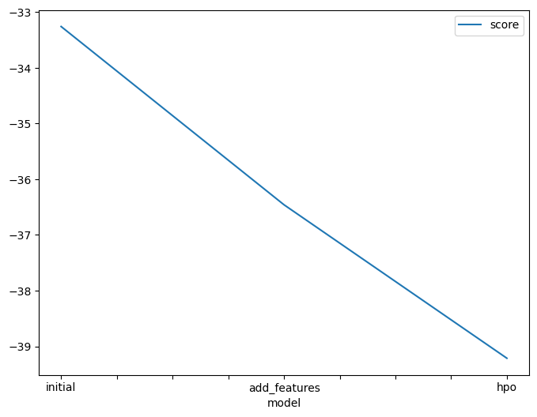
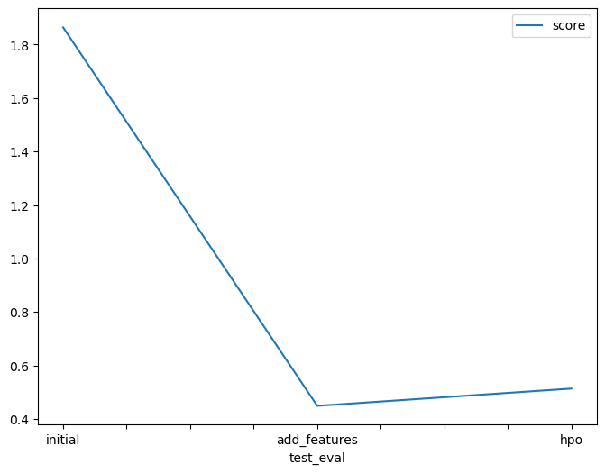

# Report: Predict Bike Sharing Demand with AutoGluon Solution
#### Wenjing Liu, 2024-11-21  

## Initial Training
### What did you realize when you tried to submit your predictions? What changes were needed to the output of the predictor to submit your results?  

* The top scores are around 0.34, while my initial submission score is 1.86413 (the smaller the better), which means I still need to work on some EDA, data cleaning, and feature engineering.

### What was the top ranked model that performed?

* Across all the submissions, whether or not feature engineering is included, the best model is always "WeightedEnsemble_L2".

## Exploratory data analysis and feature creation
### What did the exploratory analysis find and how did you add additional features?

* There are no missing values, so there's no need for data imputation.
* There is a datetime column, which is usually transformed into separate columns.  
* The "casual" and "registered" columns add up to the target "count", which suggests that performance might improve by creating two models for the same dataset—one using "casual" and the other using "registered" — and then adding their predicted counts together as the result. However, this approach didn't work.
* There are some alerts given by [the Ydata profiling report](https://nov05.github.io/udacity-cd0385-project-starter/project/ydata_profiling_report.html). 
    * High correlation between features can lead to multicollinearity, which can make the model's coefficients unstable. I could remove or combine the highly correlated features, or use dimensionality reduction techniques like Principal Component Analysis (PCA) to reduce the impact of multicollinearity.   
    * AutoGluon likely handles imbalanced data and other alerts effectively.   

  

### How much better did your model preform after adding additional features and why do you think that is?

* The score decreased from 1.86413 to 0.44920 after I added the 'year', 'month', 'day', and 'hour' columns, and dropped the 'datetime' column. I think some common sense can explain this change: biking activities are usually highly seasonal and follow an hourly pattern.  

## Hyper parameter tuning
### How much better did your model preform after trying different hyper parameters?

* It actually got worse. I didn’t spend much time experimenting with different hyperparameters or types of models, but AutoGluon simply has better pre-defined hyperparameter settings. 

### If you were given more time with this dataset, where do you think you would spend more time?

* EDA, feature importance analysis, and feature engineering

### Create a table with the models you ran, the hyperparameters modified, and the kaggle score.

|model|hpo1|hpo2|hpo3|score|
|--|--|--|--|--|
|initial|default|default|default|1.86413|
|add_features|default|default|default|0.44920|
|hpo|default|default|default|0.51375|

### Create a line plot showing the top model score for the three (or more) training runs during the project.  

### Create a line plot showing the top kaggle score for the three (or more) prediction submissions during the project.   

## Summary

* AutoGluon is a very effective tool for prototyping machine learning models. However, to achieve the best results, extensive EDA and feature engineering are still necessary.  
